## Part 1. Готовый докер

Возьми официальный докер-образ с nginx и выкачай его при помощи docker pull

Проверь наличие докер-образа через docker images

Запусти докер-образ через docker run -d [image_id|repository]

Проверь, что образ запустился через docker ps

Посмотри информацию о контейнере через docker inspect [container_id|container_name]

[

    {

        "Id": "c153643c2bb187dd708326369b12f4c77d74a7b636a91008561c15a839d6acbe",

        "Created": "2024-09-16T19:38:20.880380258Z",

        "Path": "/docker-entrypoint.sh",

        "Args": [

            "nginx",

            "-g",

            "daemon off;"

        ],

        "State": {

            "Status": "running",

            "Running": true,

            "Paused": false,

            "Restarting": false,

            "OOMKilled": false,

            "Dead": false,

            "Pid": 543,

            "ExitCode": 0,

            "Error": "",

            "StartedAt": "2024-09-16T19:38:21.243135969Z",

            "FinishedAt": "0001-01-01T00:00:00Z"

        },

        "Image": "sha256:39286ab8a5e14aeaf5fdd6e2fac76e0c8d31a0c07224f0ee5e6be502f12e93f3",

        "ResolvConfPath": "/var/lib/docker/containers/c153643c2bb187dd708326369b12f4c77d74a7b636a91008561c15a839d6acbe/resolv.conf",

        "HostnamePath": "/var/lib/docker/containers/c153643c2bb187dd708326369b12f4c77d74a7b636a91008561c15a839d6acbe/hostname",

        "HostsPath": "/var/lib/docker/containers/c153643c2bb187dd708326369b12f4c77d74a7b636a91008561c15a839d6acbe/hosts",

        "LogPath": "/var/lib/docker/containers/c153643c2bb187dd708326369b12f4c77d74a7b636a91008561c15a839d6acbe/
        c153643c2bb187dd708326369b12f4c77d74a7b636a91008561c15a839d6acbe-json.log",

        "Name": "/sharp_pike",

        "RestartCount": 0,

        "Driver": "overlay2",

        "Platform": "linux",

        "MountLabel": "",

        "ProcessLabel": "",

        "AppArmorProfile": "",

        "ExecIDs": null,

        "HostConfig": {

            "Binds": null,

            "ContainerIDFile": "",

            "LogConfig": {

                "Type": "json-file",

                "Config": {}

            },

            "NetworkMode": "bridge",

            "PortBindings": {},

            "RestartPolicy": {

                "Name": "no",

                "MaximumRetryCount": 0

            },

            "AutoRemove": false,

            "VolumeDriver": "",

            "VolumesFrom": null,

            "ConsoleSize": [

                24,

                80

            ],

            "CapAdd": null,

            "CapDrop": null,

            "CgroupnsMode": "private",

            "Dns": [],

            "DnsOptions": [],

            "DnsSearch": [],

            "ExtraHosts": null,

            "GroupAdd": null,

            "IpcMode": "private",

            "Cgroup": "",

            "Links": null,

            "OomScoreAdj": 0,

            "PidMode": "",

            "Privileged": false,

            "PublishAllPorts": false,

            "ReadonlyRootfs": false,

            "SecurityOpt": null,

            "UTSMode": "",

            "UsernsMode": "",

            "ShmSize": 67108864,

            "Runtime": "runc",

            "Isolation": "",

            "CpuShares": 0,

            "Memory": 0,

            "NanoCpus": 0,

            "CgroupParent": "",

            "BlkioWeight": 0,

            "BlkioWeightDevice": [],

            "BlkioDeviceReadBps": [],

            "BlkioDeviceWriteBps": [],

            "BlkioDeviceReadIOps": [],

            "BlkioDeviceWriteIOps": [],

            "CpuPeriod": 0,

            "CpuQuota": 0,

            "CpuRealtimePeriod": 0,

            "CpuRealtimeRuntime": 0,

            "CpusetCpus": "",

            "CpusetMems": "",

            "Devices": [],

            "DeviceCgroupRules": null,

            "DeviceRequests": null,

            "MemoryReservation": 0,

            "MemorySwap": 0,

            "MemorySwappiness": null,

            "OomKillDisable": null,

            "PidsLimit": null,

            "Ulimits": [],

            "CpuCount": 0,

            "CpuPercent": 0,

            "IOMaximumIOps": 0,

            "IOMaximumBandwidth": 0,

            "MaskedPaths": [

                "/proc/asound",

                "/proc/acpi",

                "/proc/kcore",

                "/proc/keys",

                "/proc/latency_stats",

                "/proc/timer_list",

                "/proc/timer_stats",

                "/proc/sched_debug",

                "/proc/scsi",

                "/sys/firmware",

                "/sys/devices/virtual/powercap"

            ],

            "ReadonlyPaths": [

                "/proc/bus",

                "/proc/fs",

                "/proc/irq",

                "/proc/sys",

                "/proc/sysrq-trigger"

            ]

        },

        "GraphDriver": {

            "Data": {

                "LowerDir": "/var/lib/docker/overlay2/87fc0c8200ac5bdd5a7cafff51aa4244c289d3797745469162b471a450710aaa-init/diff:/var/lib/docker/overlay2/

                c99892aba312eba2ea3b38ccd4c8f6b922adf1e20ef463548e1f2e1f7f7a6b5e/diff:/var/lib/docker/overlay2/

                5cc47596e98c8049f6f4c0f325a283fc3f0ff3edd99ec3619bbc15467ed2c5d7/diff:/var/lib/docker/overlay2/

                7babdc842fc09b8fdb9b4466e7097057c63ce96fe6fbb3be7bbf54c41857925d/diff:/var/lib/docker/overlay2/

                bf54a965b60fac7771e8fe73c371660bb1240405d3da338bf51bab81d9e36d2e/diff:/var/lib/docker/overlay2/

                af743f4cacb10e58396782a2e19f5280a74c8e8292f5f75efd7ea4f800c72213/diff:/var/lib/docker/overlay2/

                8268322a3216d25e28606056b0788c2d3288f62a4466fd547e382ea81152a66d/diff:/var/lib/docker/overlay2/

                0c74be7f6ba8ca908ff7e7c1584c73256718f4803fcc07c5fd3c9b56e5f96f16/diff",

                "MergedDir": "/var/lib/docker/overlay2/87fc0c8200ac5bdd5a7cafff51aa4244c289d3797745469162b471a450710aaa/merged",

                "UpperDir": "/var/lib/docker/overlay2/87fc0c8200ac5bdd5a7cafff51aa4244c289d3797745469162b471a450710aaa/diff",

                "WorkDir": "/var/lib/docker/overlay2/87fc0c8200ac5bdd5a7cafff51aa4244c289d3797745469162b471a450710aaa/work"

            },

            "Name": "overlay2"

        },

        "Mounts": [],

        "Config": {

            "Hostname": "c153643c2bb1",

            "Domainname": "",

            "User": "",

            "AttachStdin": false,

            "AttachStdout": false,

            "AttachStderr": false,

            "ExposedPorts": {

                "80/tcp": {}

            },

            "Tty": false,

            "OpenStdin": false,

            "StdinOnce": false,

            "Env": [

                "PATH=/usr/local/sbin:/usr/local/bin:/usr/sbin:/usr/bin:/sbin:/bin",

                "NGINX_VERSION=1.27.1",

                "NJS_VERSION=0.8.5",

                "NJS_RELEASE=1~bookworm",

                "PKG_RELEASE=1~bookworm",

                "DYNPKG_RELEASE=2~bookworm"

            ],

            "Cmd": [

                "nginx",

                "-g",

                "daemon off;"

            ],

            "Image": "nginx",

            "Volumes": null,

            "WorkingDir": "",

            "Entrypoint": [

                "/docker-entrypoint.sh"

            ],

            "OnBuild": null,

            "Labels": {

                "maintainer": "NGINX Docker Maintainers \u003cdocker-maint@nginx.com\u003e"

            },

            "StopSignal": "SIGQUIT"

        },

        "NetworkSettings": {

            "Bridge": "",

            "SandboxID": "0afdf661a59ece77d02a7a2fd80a2269f9ccad5aac239f2524b3f2f75c8b6f38",

            "SandboxKey": "/var/run/docker/netns/0afdf661a59e",

            "Ports": {

                "80/tcp": null

            },

            "HairpinMode": false,

            "LinkLocalIPv6Address": "",

            "LinkLocalIPv6PrefixLen": 0,

            "SecondaryIPAddresses": null,

            "SecondaryIPv6Addresses": null,

            "EndpointID": "7e325864b7b47e67271055ea5ceaa2761561b68ff27180d7c588e92ad6e8a3c9",

            "Gateway": "172.17.0.1",

            "GlobalIPv6Address": "",

            "GlobalIPv6PrefixLen": 0,

            "IPAddress": "172.17.0.2",

            "IPPrefixLen": 16,

            "IPv6Gateway": "",

            "MacAddress": "02:42:ac:11:00:02",

            "Networks": {

                "bridge": {

                    "IPAMConfig": null,

                    "Links": null,

                    "Aliases": null,

                    "MacAddress": "02:42:ac:11:00:02",

                    "DriverOpts": null,

                    "NetworkID": "c86eefb57ecba4636e5b75dbd48be80451d279a21682ccd029616a4303363424",

                    "EndpointID": "7e325864b7b47e67271055ea5ceaa2761561b68ff27180d7c588e92ad6e8a3c9",

                    "Gateway": "172.17.0.1",

                    "IPAddress": "172.17.0.2",

                    "IPPrefixLen": 16,

                    "IPv6Gateway": "",

                    "GlobalIPv6Address": "",

                    "GlobalIPv6PrefixLen": 0,

                    "DNSNames": null

                }
            }

        }

    }

]

По выводу команды определим размер контейнера, список замапленных портов и ip контейнера

размер контейнера:

замаппенные порты:

ip контейнера:

Остановим докер контейнер через docker stop [container_id|container_name]

Проверяем, что контейнер остановился через docker ps

Запустим докер с портами 80 и 443 в контейнере, замапленными на такие же порты на локальной машине, через команду run

Проверяем, что в браузере по адресу localhost:80 доступна стартовая страница nginx

 Перезапустить докер контейнер через docker restart [container_id|container_name]

 Проверить любым способом, что контейнер запустился

## Part 2. Операции с контейнером

Прочитаем конфигурационный файл nginx.conf внутри докер контейнера через команду exec

Создаем на локальной машине файл nginx.conf и настраиваем в нем по пути /status отдачу страницы статуса сервера nginx

Скопируем созданный файл nginx.conf внутрь докер-образа через команду docker cp

Перезапустим nginx внутри докер-образа через команду exec

Проверим, что по адресу localhost:80/status отдается страничка со статусом сервера nginx

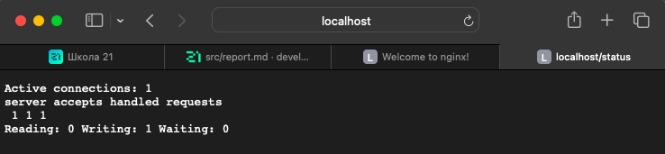

Экспортируем контейнер в файл container.tar через команду export и остановим контейнер

Удалили образ через docker rmi [image_id|repository], не удаляя перед этим контейнеры

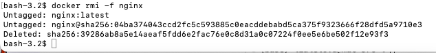

Удалили остановленный контейнер

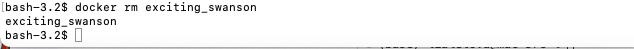

Импортировали контейнер обратно через команду import

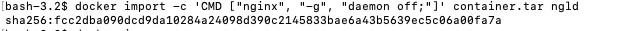

Запустили импортированный контейнер

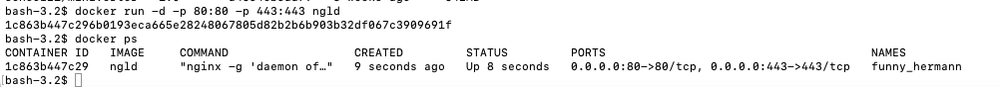

Проверили, что по адресу localhost:80/status отдается страничка со статусом сервера nginx

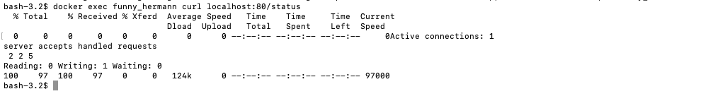

## Part 3. Мини веб-сервер

Написали мини сервер на C и FastCgi, который будет возвращать простейшую страничку с надписью Hello World!

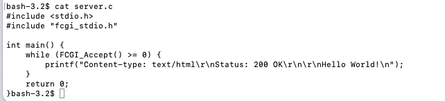

Написали свой nginx.conf, который будет проксировать все запросы с 81 порта на 127.0.0.1:8080

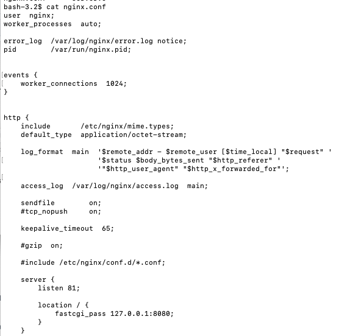

Скопировали созданный nginx.conf и мини сервер в контейнер и зашли в него

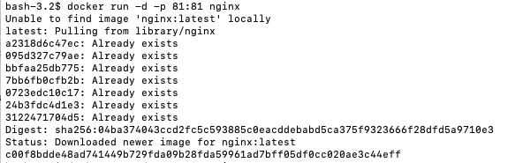

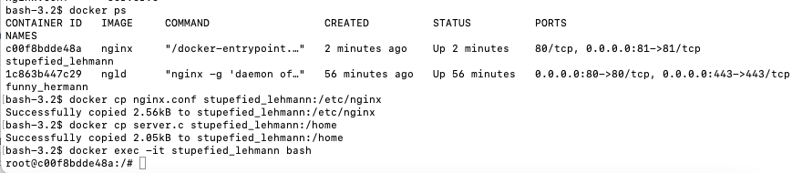

-y опция команды apt-get указывает на автоматическое подтверждение установки пакетов без запроса подтверждения от пользователя. Это полезно при автоматической установке пакетов в скриптах или в среде контейнеров, где интерактивное взаимодействие с пользователем невозможно.

Установили требуемые ПО

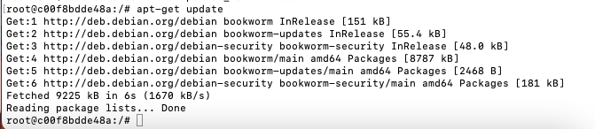

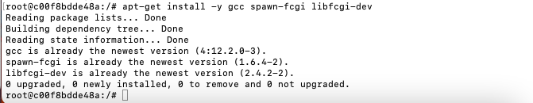

Скомпилировали и запустили написанный мини сервер через spawn-fcgi на порту 8080

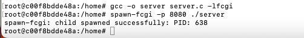

Проверили, что в браузере по localhost:81 отдается написанная вами страничка

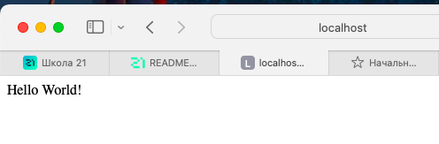

Положили файл nginx.conf по пути ./nginx/nginx.conf docker cp nginx.conf :/etc/nginx/nginx.conf

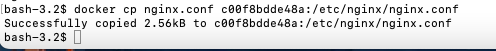

## Part 4. Свой докер

### Написали свой докер образ, который:

собирает исходники мини сервера на FastCgi из Части 3

запускает его на 8080 порту

копирует внутрь образа написанный ./nginx/nginx.conf

запускает nginx

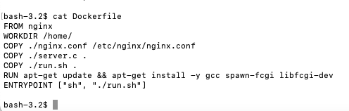

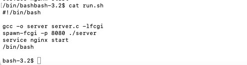

Собрали написанный докер образ через docker build при этом указав имя и тег

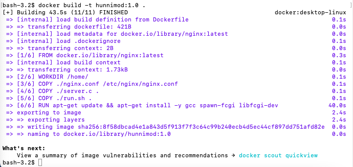

Проверили через docker images, что все собралось корректно

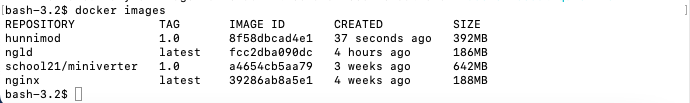

Запустили собранный докер образ с маппингом 81 порта на 80 на локальной машине и маппингом папки ./nginx внутрь контейнера по адресу, где лежат конфигурационные файлы nginx'а (см. Часть 2)

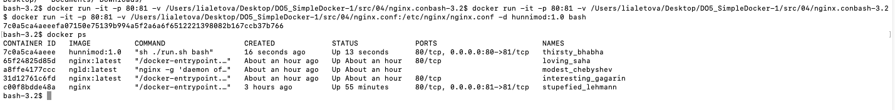

-p 81:80 - это опция для маппинга портов. Она указывает, что порт 80 на локальной машине будет проксироваться на порт 81 внутри контейнера.

-v - это опция для маппинга папки. Она указывает, что текущая папка /Users/josefina/DO5_SimpleDocker-1/src/04/nginx.conf на локальной машине будет монтироваться в путь /etc/nginx/nginx.conf внутри контейнера.

Проверили, что по localhost:80 доступна страничка написанного мини сервера

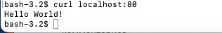

Дописали в ./nginx/nginx.conf проксирование странички /status, по которой надо отдавать статус сервера nginx

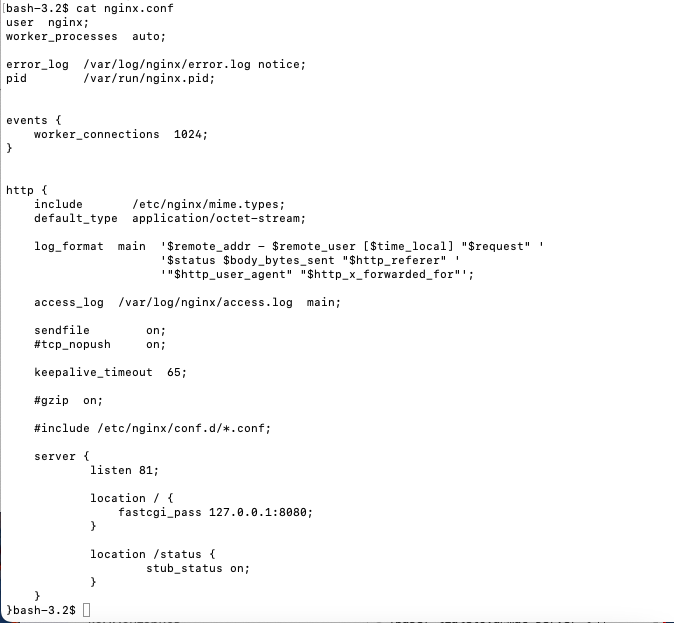

Перезапустили докер образ

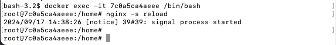

Проверили, что теперь по localhost:80/status отдается страничка со статусом nginx

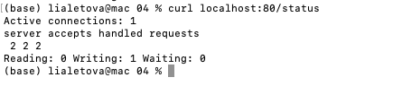

## Part 5. Dockle

Просканировали образ из предыдущего задания через dockle [image_id|repository]

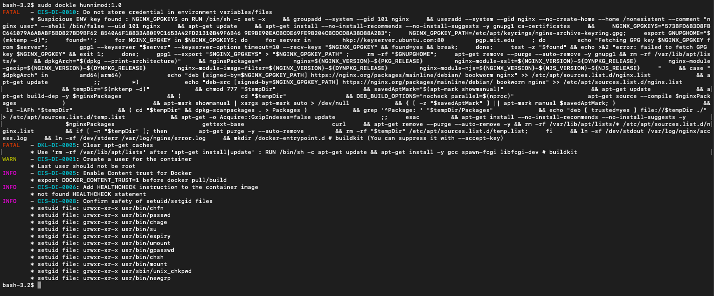

Исправили образ так, чтобы при проверке через dockle не было ошибок и предупреждений

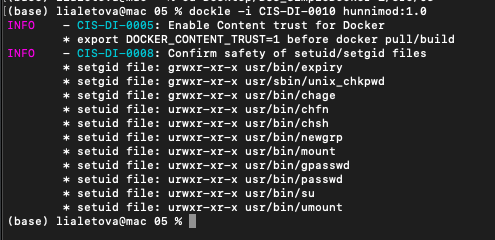

## Part 6. Базовый Docker Compose

Написали файл docker-compose.yml, с помощью которого:

Подняли докер контейнер из Части 5 (он должен работать в локальной сети, т.е. не нужно использовать инструкцию EXPOSE и мапить порты на локальную машину)

Подняли докер контейнер с nginx, который будет проксировать все запросы с 8080 порта на 81 порт первого контейнера

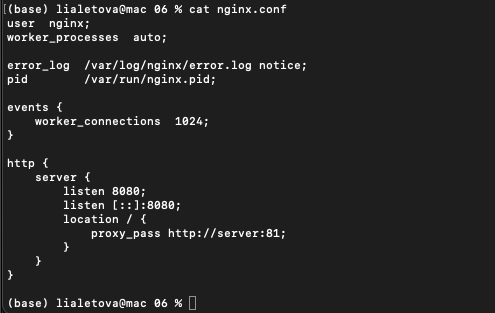

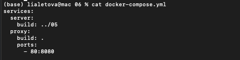

Изменили скрипт для запуска и перезагрузки nginx. Сделали так, чтобы контейнер пребывал в запущенном состоянии.

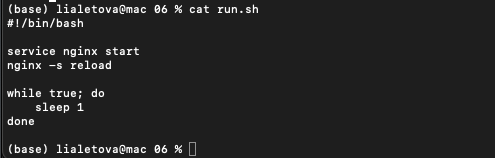

Остановили все запущенные контейнеры docker-compose down

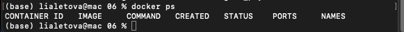

Собрали и запустили проект с помощью команд docker-compose build и docker-compose up

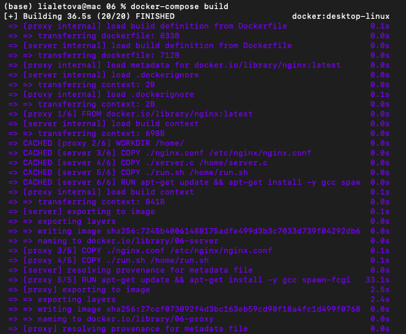

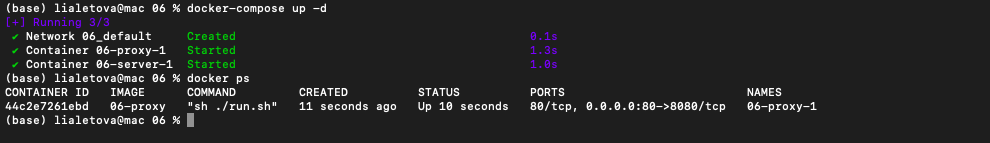

Проверили, что в браузере по localhost:80 отдается написанная вами страничка, как и ранее

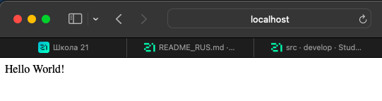

